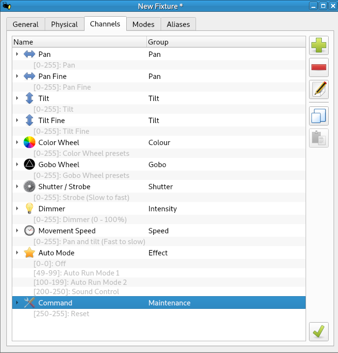
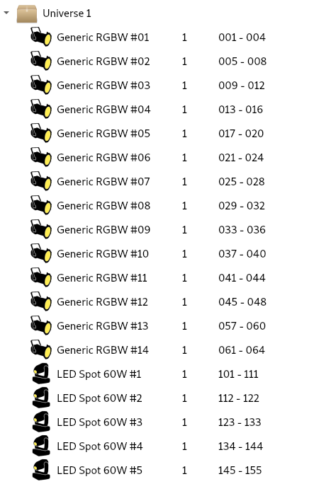

# DMX @ null : Configuration Guide

The lights should work with most DMX light control software, e.g. [QLC+](https://www.qlcplus.org), [Lightkey](https://www.lightkeyapp.com)

Below are the

- [fixture types](#fixture-types)
- [fixtures](#fixtures)

Once these are setup, then configure to output over ArtNet and away you go!

## Fixture Types

### Generic RGBW

Use built-in "Generic RGBW".

### Moving Head

Create a custom fixture with the following properties:

## Fixtures

The universe is setup as follows:

RGBW #1 - 12 are on the ceiling mounted channel.

RGBW #13, #14 are floating on the stage.
