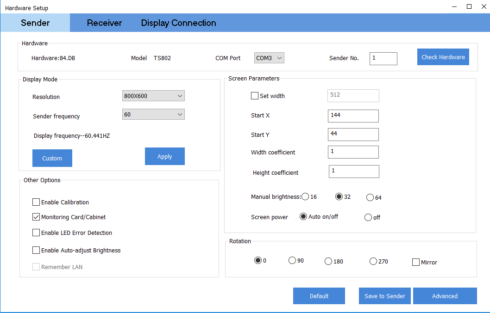
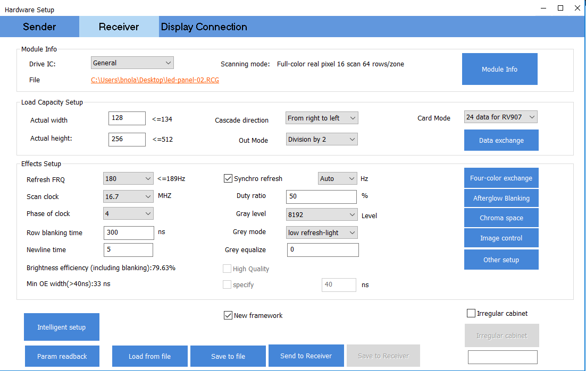
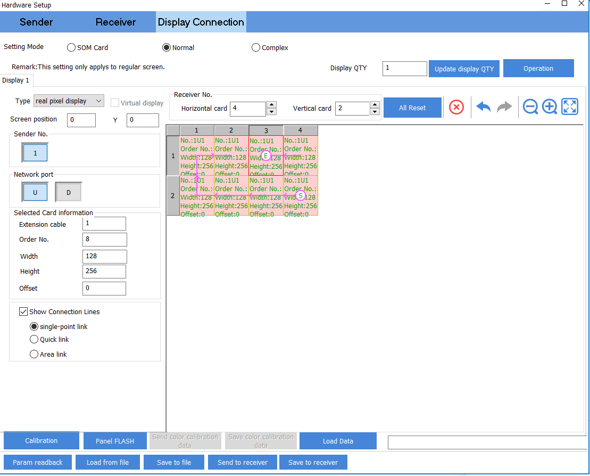

# LED Panels Configuration Guide

## Software setup

To configure the panels to work with the sender, follow these instructions:
- On a windows PC, download the latest LEDSet software from the [Linsn website](https://www.linsnled.com/led-control-software.html).
- Connect the sender to the PC via the HDMI and USB connections.
- Open the LEDSet software. Once the software recognizes the sender, load the pre-configured [led-panels.RCG](led-panels.RCG) or [led-panels.CON](led-panels.CON) files.
- You'll need to click the `Save to Sender` / `Send to Receiver` / `Save to Receiver` buttons to send or save the data to the sender and panels.
- If the config files above don't work, try loading the stock RCG files in the `/stock-rcg-files` folder. These were provided to us by the LED Panel supplier ([ASLLED](https://aslleddisplay.en.alibaba.com/)).

If the above instructions worked, you should have a program output in LEDSet similar to the images below. If not (and the panels aren't displaying correctly), you can update the configuration to match. Once the data has been saved to the sender and panels, the USB can be disconnected between the PC and the sender.

## Sender config

## Receiver config

## Display connection config

NB: this is accurate as of 12/04/22, when we had 8 panels in a 4x2 configuration, and each panel was oriented vertically. If more panels are added, or the physical panel configuration changes, you will need to update the display connection settings.
